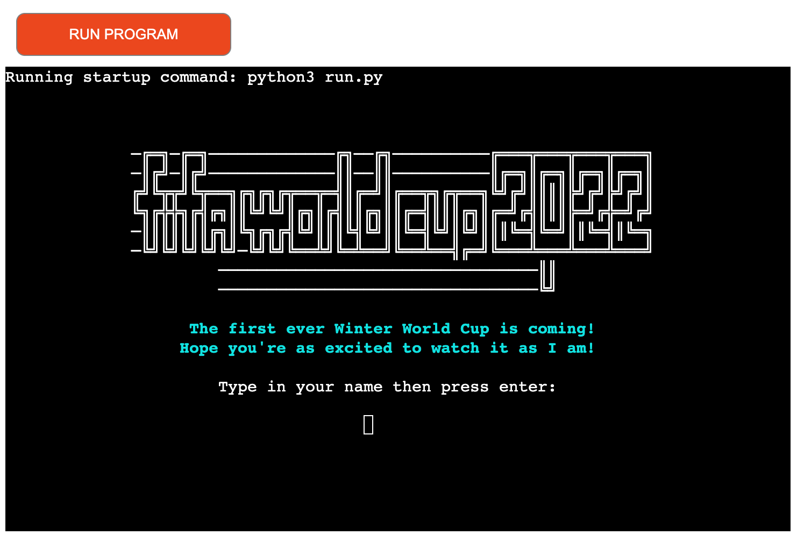
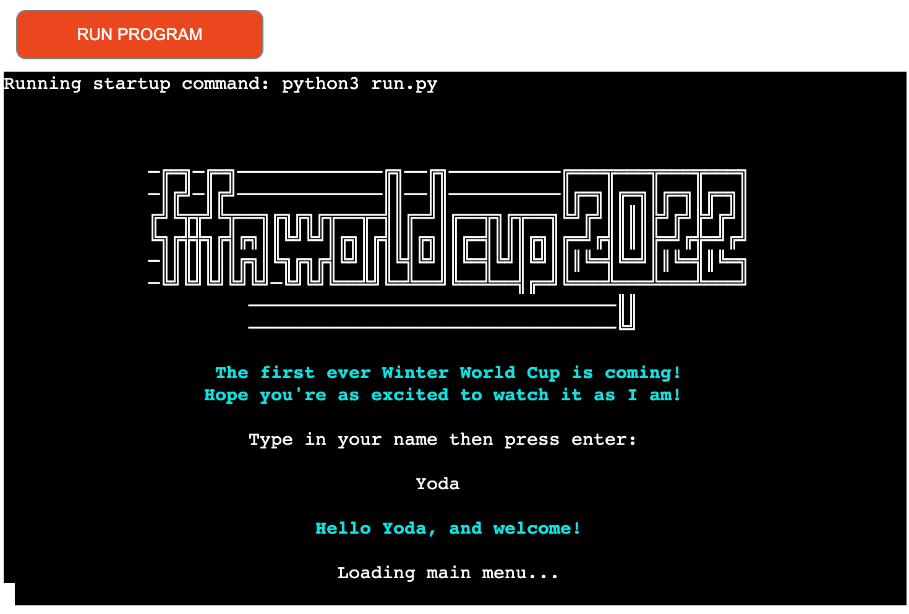

# Winter World Cup

FIFA World Cup 2022 is just months away and all of us fans of the beautiful game couldn't be more excited! 

To celebrate the upcoming first ever Winter World Cup, I think it's appropriate to create a simple application through Python that users can tinker with to obtain information about the quadrennial tournament. Moreover, they can also take part in a simple trivia quiz that tests their knowledge of the World Cup.

The creation of this application is intended to showcase the application of Python in a real-world context. 
Heroku is used to deploy the application on a webpage.

[Go to application](https://winter-world-cup.herokuapp.com/)

## Objective

The application is intended to provide and display information to users with regard to FIFA World Cup 2022. The application stores data regarding the venues, or stadiums, that matches are going to take place at. Users can also obtain information with regard to national teams participating in the tournament by way of their respective groups. Moreover, users can remind themselves of upcoming match schedules through fixtures data that can be observed within the application. Last but not least, a simple test of World Cup knowledge should provide a bit of a fun challenge to all.

## Structure & Design

This project is exclusively backend-focused. The project runs on a command line interface, or as Mac users call it, a Terminal. The most important part of the design is to make the texts, including ascii header texts and arts, clearly visible and readable for users. This should be done through proper text alignment and spacing. I decided to center-position some text and header elements for visual clarity, while also maintaining other elements in their natural left-aligned positions. 

I installed the Colorama module in order to produce appealing texts as it provides a simple cross-platform API to print colored terminal text from Python applications. And as mentioned previously, I also rely on ascii arts and texts for the purpose of visual appeal.

# Features

### Initial Startup

As seen below, users will be greeted by an ascii text of FIFA World Cup 2022 which is followed by two lines of message. Directly below them, users should enter their name (can be anything, really) in order to use the application. A short welcome message greets the users, and the terminal loads to the main menu.

<b>Initial Startup</b>

 

### Main Menu

-----
Happy coding!