# Winter World Cup

FIFA World Cup 2022 is just months away and all of us fans of the beautiful game couldn't be more excited! 

To celebrate the upcoming first ever Winter World Cup, I think it's appropriate to create a simple application through Python that users can tinker with to obtain information about the quadrennial tournament. Moreover, they can also take part in a simple trivia quiz that tests their knowledge of the World Cup.

The creation of this application is intended to showcase the application of Python in a real-world context. 
Heroku is used to deploy the application on a webpage.

[Go to application](https://winter-world-cup.herokuapp.com/)

## Objective

The application is intended to provide and display information to users with regard to FIFA World Cup 2022. The application stores data regarding the venues, or stadiums, that matches are going to take place at. Users can also obtain information with regard to national teams participating in the tournament by way of their respective groups. Moreover, users can remind themselves of upcoming match schedules through fixtures data that can be observed within the application. Last but not least, a simple test of World Cup knowledge should provide a bit of a fun challenge to all.

## Structure & Design

This project is exclusively backend-focused. The project runs on a command line interface, or as Mac users call it, a Terminal. The most important part of the design is to make the texts, including ascii header texts and arts, clearly visible and readable for users. This should be done through proper text alignment and spacing. I decided to center-position some text and header elements for visual clarity, while also maintaining other elements in their natural left-aligned positions. 

I installed the Colorama module in order to produce appealing texts as it provides a simple cross-platform API to print colored terminal text from Python applications. And as mentioned previously, I also rely on ascii arts and texts for the purpose of visual appeal.

## Features

### Initial Startup

As seen below, users will be greeted by an ascii text of FIFA World Cup 2022 which is followed by two lines of message in cyan. Directly below them, users should enter their name (can be anything, really) in order to use the application. A short welcome message greets the users, and the terminal loads to the main menu.

<b>Initial Startup</b>

 

### Main Menu

The main menu is the second page of the application, and it uses an ascii text as the header. Here users are met with five different choices of interaction with the application. They can go to World Cup venues to obtain information about the stadiums for the upcoming tournament. Second, they can check National Teams to obtain information about all of the qualified (and yet to be qualified) teams participating in the World Cup. Similarly, the third option gives users information about all upcoming fixtures for each and every participating team. The fourth option takes the users to a simple trivia quiz page set up to challenge their knowledge about World Cup. Finally, users can choose to exit the application via the fifth and last option.

<b>Main Menu</b>

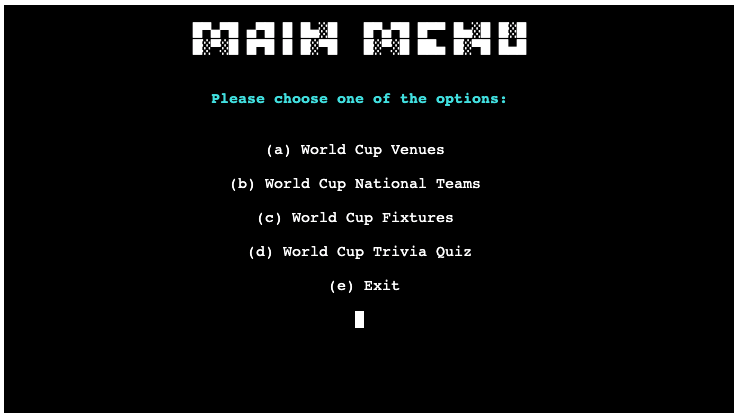

 

### Option A: Venues

Venues page displays information to the user with regard to the stadiums at which the football matches will take place, and how much capacity is available for each of these venues. There are a total of eight stadiums which are spread around four cities in Qatar.

Below the table, users will have two options to pick from. They can press m and enter to go back to the main menu as indicated by the cyan text, or they can choose to exit the terminal altogether by pressing e and enter as indicated by the yellow text.

<b>Venues</b>

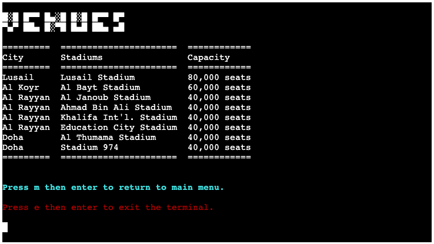

 

### Option B: National Teams

Should the users pick option B, the next page that loads will ask users to pick one between group A - H, as there are eight groups in total. 

<b>Options</b>

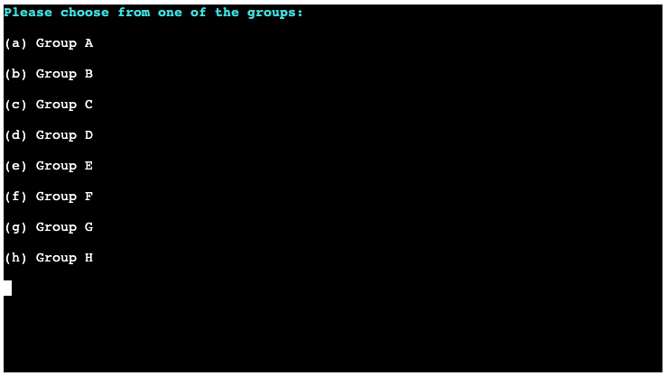

 

As an example, choosing Group A will take users to a page that displays information about Group A. The Teams ascii text header can be seen at the top which is followed by a four-column table. The left-most column shows users the four national teams belonging to Group A. The rest of the columns displays the teams' fifa rankings, the respective managers as well as star players.

As before, users will have two options to pick from below the Teams table. They can press m and enter to go back to the main menu as indicated by the cyan text, or they can choose to exit the terminal altogether by pressing e and enter as indicated by the yellow text.

<b>Teams</b>

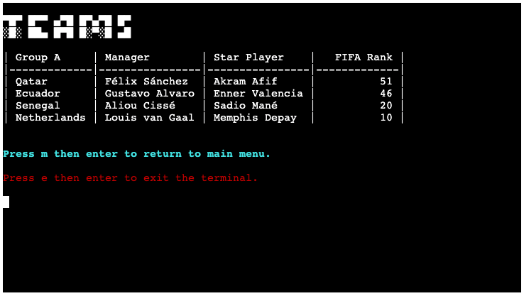

 

### Option C: Fixtures

Similar to Option B, the next page that loads after choosing Option C will ask users to pick one between group A - H.

As an example, choosing Group H will take users to a page that displays fixture information about Group H's upcoming matches in the World Cup. The Fixtures ascii text header can be seen at the top which is followed by a four-column table. The left-most column shows all six upcoming fixtures for Group H, followed by three other columns that inform users about where each match will take place, specifically at which venue, as well as their exact match date and time (CET).

As before, users will have two options to pick from below the Fixtures table. They can press m and enter to go back to the main menu as indicated by the cyan text, or they can choose to exit the terminal altogether by pressing e and enter as indicated by the yellow text.

<b>Fixtures</b>

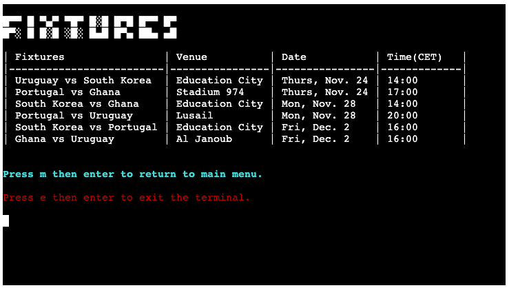

 

### Option D: Trivia Quiz

If the user goes for Option D, the next page will load with the message as follow:

<b>Get Ready</b>

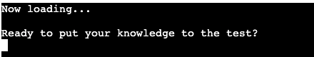

 

The next page displays the simple introduction header and messages, whereby the user is asked to press s then enter to start participating in the quiz.

<b>Quiz Intro</b>

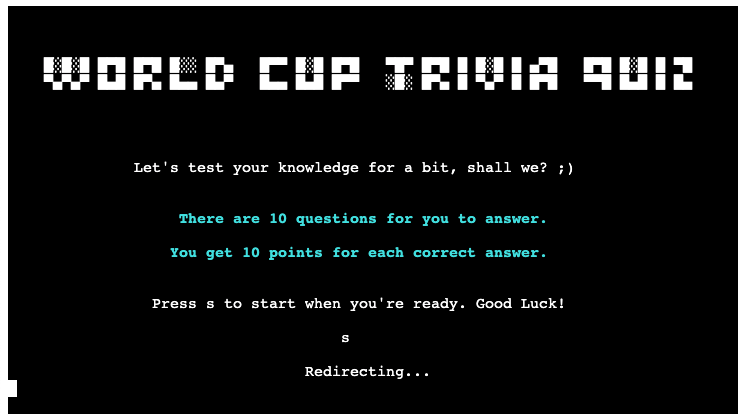

 

The next page that loads starts the quiz. The quiz consists of ten random questions out of possible twenty and they are intended to test a user's general knowledge about the World Cup. Each question has three possible answers to choose from, and users will get an immediate notification whether their answer is correct or otherwise. The next question also immediately follows below it until it ends with the tenth question. 

<b>Questions</b>

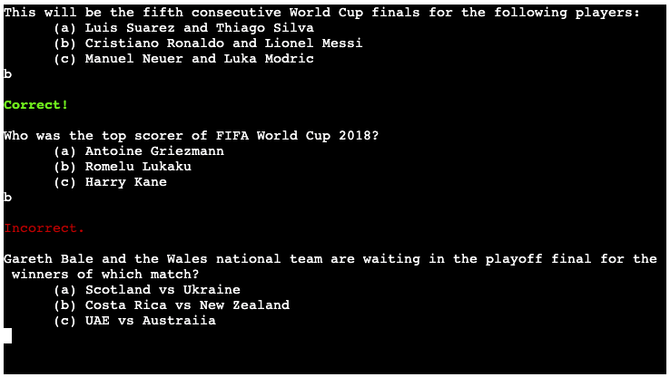

 

Every question is worth ten points, and by the end of the questions users will be able to discover how many points they manage to get. Users are then asked to type in their name, after which they are redirected to a simple leaderboard table to see how they fare with the quiz in comparison to other participants.

<b>Total Score</b>

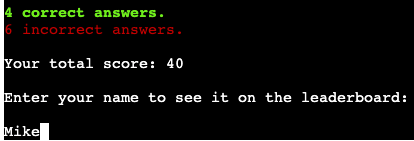

 

And as always, users will have two options to pick from below the Leaderboard table. They can press m and enter to go back to the main menu as indicated by the cyan text, or they can choose to exit the terminal altogether by pressing e and enter as indicated by the yellow text.

<b>Thanks</b>

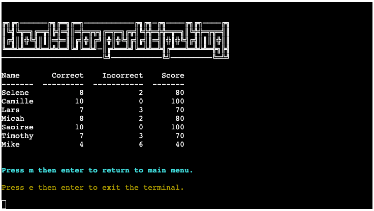

 

### Option E: Exit

Option E, or wherever users encounter the yellow message to press e, simply takes the user off the terminal. The terminal will display a closing ascii text and art, and users can choose to inteact with the terminal again by clicking on the run program button at the top.

<b>Exit</b>

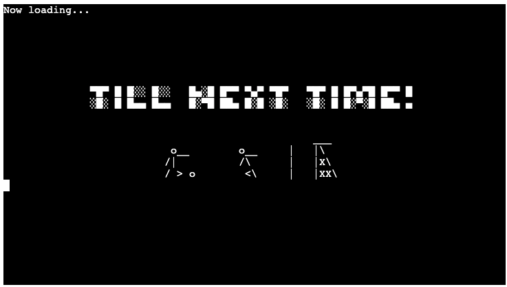

 

## Bugs Encountered

- Truth be told, I'm not quite sure whether this classifies as a bug since I'm also not very knowledgeable yet in this matter. At the end of the project, I came to be interested in installing and importing pandas to sort the leaderboard table in a descending order by value (score column). I must have missed something as I was not able to make it work in the end. I'll improve my understanding of pandas for future projects.

- During the creation of this project, I found out that center alignment and colorama module do not work on string and f-string texts that are preceded or followed by \n (either former or latter) which is used to create a new line above or below. Hence why I ended up using print() for these specific parts of my code.

## Testing

### PEP8 Testing

I can confirm that run.py, quiz.py, and strings.py have all been through thorough PEP8 Testing.

<b>PEP8 Run.py</b>

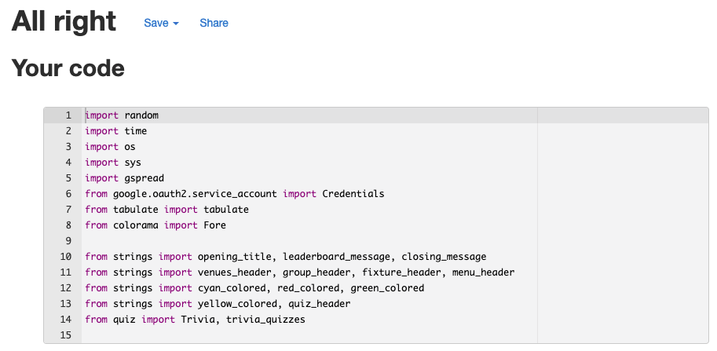

 

<b>PEP8 Quiz.py</b>

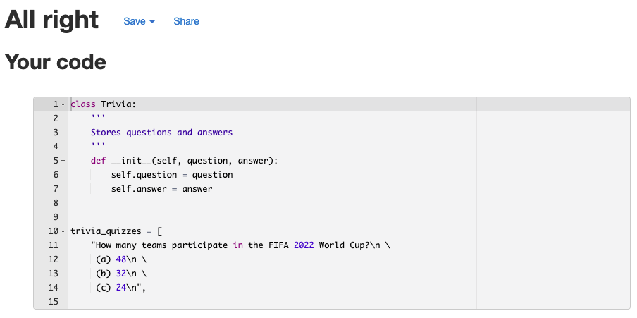

 

<b>PEP8 Strings.py</b>

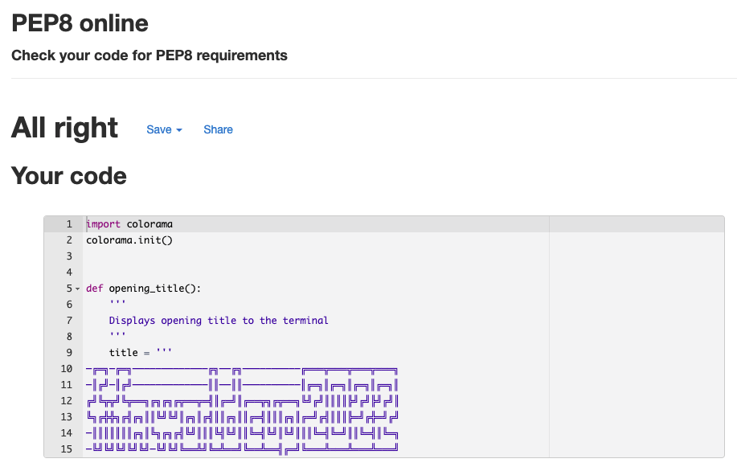

 

### Manual Testing

For this Python-focused project, manual testing has exclusively been done through the Terminal. Naturally, I have gone through uncountable amount of "Run Program" clicks throughout the testing phase. I can confirm that the following have been tried and tested properly:

1. Initial Startup
- Verify that ascii text is displayed properly.
- Verify that validate_input works as intended.
- Verify that pressing enter after name input takes users to the main menu.

2. Main Menu
- Verify that ascii text is displayed properly.
- Verify that an invalid input notification pops up if the input is incorrect.
- Verify that options a - e work as intended and bring users to their respective pages.

3. Venues
- Verify that ascii text is displayed properly.
- Verify that all values from gsheets venues table are displayed on the terminal.
- Verify that pressing m will take users back to main menu.
- Verify that pressing e will result in exiting the terminal.

4. National Teams
- Verify that choosing an option on the options page will take users to the respective groups.
- Verify that ascii text is displayed properly.
- Verify that all values from gsheets group table are displayed on the terminal.
- Verify that pressing m will take users back to main menu.
- Verify that pressing e will result in exiting the terminal.

5. Fixtures
- Verify that choosing an option on the options page will take users to the respective groups.
- Verify that ascii text is displayed properly.
- Verify that all values from gsheet fixture table are displayed on the terminal.
- Verify that pressing m will take users back to main menu.
- Verify that pressing e will result in exiting the terminal.

6. Trivia Quiz
- Verify that ascii text is displayed properly.
- Verify that validate_input works as intended.
- Verify that pressing s then enter takes users to the questions page.
- Verify that all ten questions pop up one after another.
- Verify that the correct or incorrect notification pops up after each answer.
- Verify that total score notification is displayed after the end of the quiz.
- Verify that users get redirected to leaderboard page after name input.
- Verify that ascii text on leaderboard page is displayed properly.
- Verify that leaderboard updates constantly after users take the quiz.
- Verify that pressing m will take users back to main menu.
- Verify that pressing e will result in exiting the terminal.

7. Exit
- Verify that ascii text and art are displayed as intended.

## Technologies

- [Python](https://www.python.org/) - Provides the content and structure the terminal.
- [PEP8 Online](http://pep8online.com/) - Python validation service.
- [Gitpod](https://gitpod.io/) - An integrated development environment to create and develop projects from scratch.
- [Github](https://github.com/) - Provides storage for codes and acts as a host to deploy live projects.
- [Heroku](https://dashboard.heroku.com/) - Provides deployment and hosting of the application.
- [Google Sheets](https://www.google.com/sheets/about/) - Provides data storage in a table format.
- [Google Cloud Platform](https://console.cloud.google.com/) - Provides connection between gsheets and gitpod through json.

## Packages
- [random](https://www.tutorialsteacher.com/python/random-module) - Pseudo-random number generators for the trivia quiz.
- [time.sleep](https://www.programiz.com/python-programming/time/sleep) - Suspends execution of the current thread for a given number of seconds.
- [os](https://www.tutorialsteacher.com/python/os-module) - Used to interact with the operating system, in this case to clear the terminal
- [sys](https://www.tutorialsteacher.com/python/sys-module) - Used to manipulate Python runtime environment, in this case to exit ther terminal.
- [gspread](https://pypi.org/project/gspread/) - Python API for Google Sheets
- [tabulate](https://pypi.org/project/tabulate/) - Pretty-prints tabular data in the terminal
- [colorama](https://pypi.org/project/colorama/) - Provides color to texts in the terminal

## Deployment

For this third milestone project, Heroku is used for the deployment of the application as opposed to GitHub.

1. After logging in, click the New button on the top right.
2. From the dropdown, click Create new app.
3. Type in a relevant name, choose your region, thne click Create app button.
4. Ignore the Deploy tab for the moment and click Settings tab.
5. Scroll down to and click Config Vars button, whereby you'll add "Port" in the Key field and "8000" in the Value field.
6. Below Config Vars, click Add buildpack button, whereby you'll add Python and then Node.js in that specific order.
7. Now go back to Deploy tab and choose GitHub as your Deployment method.
8. Connect to GitHub by clicking the Search button and choosing the correct repository.
9. You can now choose between Enable Automatic Deploys or manually deploy the application via Deploy Branch. After Heroku finishes building the application, you can click the View button to launch and run your terminal on a new tab.

## Credits

### Code

- Code Institute's own tutorial project Love Sandwich is used as a guidance.
- Python's [Docs Site](https://docs.python.org/) is very informative and insightful for the creation of this project.
- I spent a good chunk of time to delve deeper with Python via [CodeCademy](https://www.codecademy.com/learn).

### Content

- [fsymbols](https://fsymbols.com/) for the creation of all ascii texts.
- [asciiart](https://www.asciiart.eu/sports-and-outdoors/soccer) for the ascii art displayed when users exit the terminal.

### Acknowledgements

I would like to thank my mentor [Akshat Garg](https://www.linkedin.com/in/akshatnitd/) for his support throughout my third milestone project, especially with how to properly refactor my code for clarity and readability. I also give my thanks to Code Institute for the prototype project Love Sandwich. And lastly, I am grateful to the Slack Community for the helpful review of my website.

See you in the fourth milestone project!

-----
Happy coding!